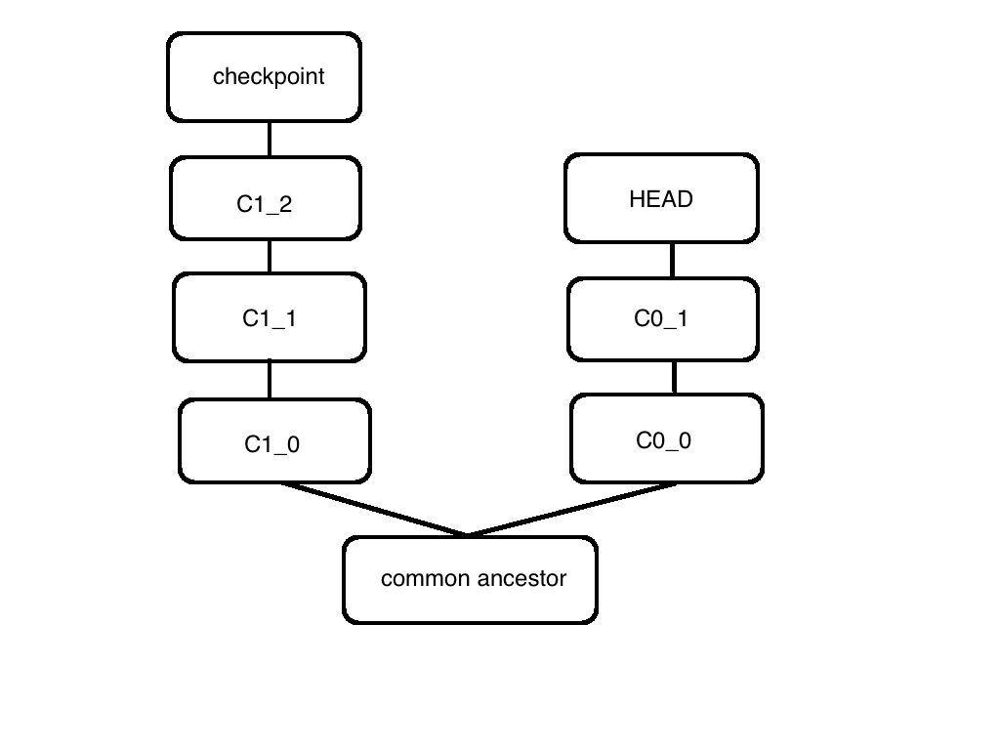

## [Fork Choice Rule](https://github.com/ethereum/research/wiki/Casper-Version-1-Implementation-Guide)
* 一個 epoch 橫跨數個區塊，這裡假設為橫跨 100 個區塊。
* **checkpoint** 指的是是每個 epoch 驗證者要負責 finalize 的區塊。當 checkpoint 收到超過 2/3 比例的 commit 時，視為 finalized。
* 每個 checkpoint 會有分數，如果該 checkpoint 的 prepare 超過 2/3 ，則它的分數是它的 commit 數（是百分比），否則為零。
* 每次收到新的 checkpoint 都要同時驗證其 prepare 和 commit 的合法性（即檢查驗證者是否可以prepare、commit，及其簽章是否有效）。

步驟：
將 HEAD 視為目前這條鏈的參考點，會不斷更新
1. 如果是第一次上線，則將 genesis block 設為 HEAD。
2. 每次收到一個新的 checkpoint，如果是接在 HEAD 之後的，則直接將該 checkpoint 設為 HEAD。
3. 如果收到的 checkpoint 分數比 HEAD 高且不接在 HEAD 之後（即出現分叉，如下圖），先找到兩者的第一個共同長輩區塊（common ancestor）
    * 這時除非該 checkpoint 的分數高於所有 HEAD 到 common ancestor 間的所有 checkpoint 的分數（即 HEAD、C0\_1、C0\_0）才將該 checkpoint 設為 HEAD
    * 否則不理會該 checkpoint

4. 同時紀錄從 checkpoint 開始算起的 PoW 區塊數量（即如果 checkpoint 為第 17200 個區塊，則紀錄從它算起最長的 PoW 鏈，但最長不超過 100 個區塊，即不紀錄超過 17300 的區塊）。
如果分叉經過比較發現兩條的 HEAD 都一樣，則比較它們由第 4 點算出的 PoW 鏈（用 PoW 的比較方法，即最長鏈勝出）。

___
註1：在步驟的第 3 點選擇分叉時，不能換掉已經被 finalized 的區塊。例如假設 C0_1 已經被 finalize，則即便 checkpoint 的分數比 HEAD、C0\_1 和 C0\_0 都還高，也不會切換過去。  

註2：會把收到的不同分叉都紀錄下來，不會比較完就把不需要的鏈的資料丟掉，但也可以用註1的規則來清理掉不可能會切換過去的鏈的資料。