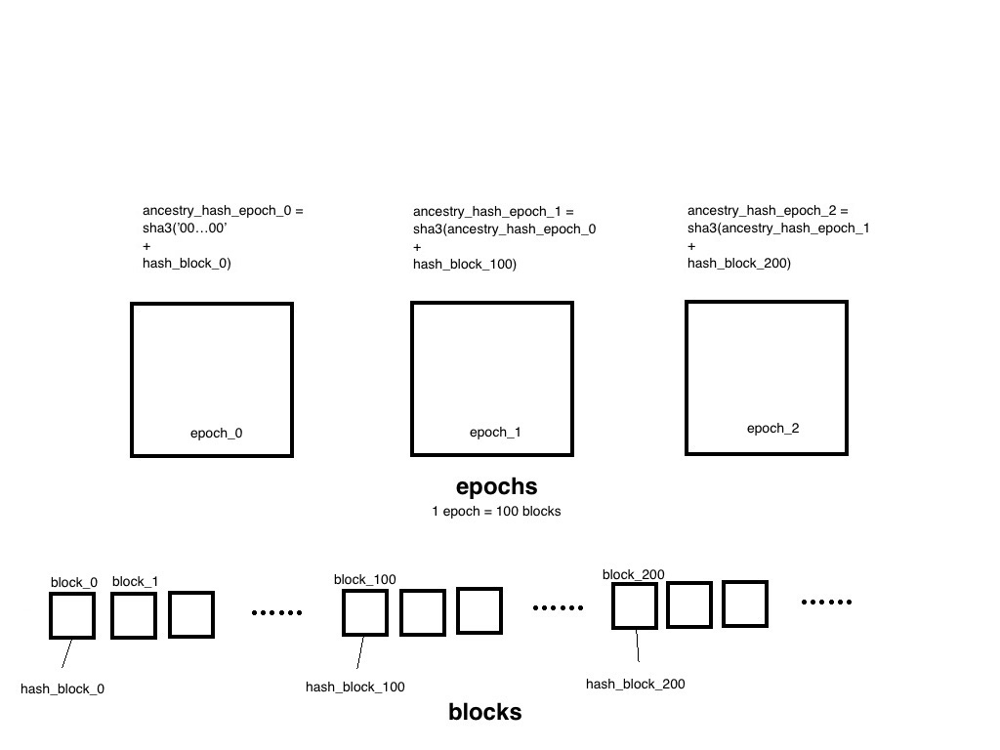

## Hash of each epoch - Ancestor Hash
* there's a hash called 'Ancestry Hash' in each epoch and it's calculated by concat  the Ancestry Hash of previous epoch with hash of the block in the beginning of current epoch and hash it, looks like this
```
sha3(
    concat(
        self.real_ancestry_hash[self.current_epoch-1]       //ancestry hash of previous epoch
        , blockhash(self.current_epoch * self.epoch_length) //hash of the block in the beginning of current epoch
    )
)
```

## Prepare Rules

1. a prepare needs to *link to/based upon* a previous **justified** prepare(by justified it means that more than 2/3 of validators submit the same prepare, see **PREPARE_REQ** in [Minimal Slashing Condition](https://medium.com/@VitalikButerin/minimal-slashing-conditions-20f0b500fc6c)).
2. in each prepare, message include
    * current epoch
    * ancestry hash of current epoch
    * source epoch
    * ancestry hash of source epoch
3. the hash been justified and the hash been prepared is a little different(by been prepared it means where the deposit size staked on is counted)
    * the hash been justified is the ancestry hash of each epoch
    * the hash been prepared is the hash of the above four values(in #2), looks like this
 
```
sha3(
    concat(
        as_bytes32(epoch)           //current epoch number represented in bytes
        , ancestry_hash             //ancestry hash of current epoch
        , as_bytes32(source_epoch)  //source epoch number represented in bytes
        , source_ancestry_hash      //ancestry hash of source epoch
    )
)
```



## Commit Rules

1. can only commit on a justified ancestry hash
2. can only commit in the exact same epoch as now, i.e, in epoch 3365 you can only commit on (justified) ancestry hash of epoch 3365, not earlier